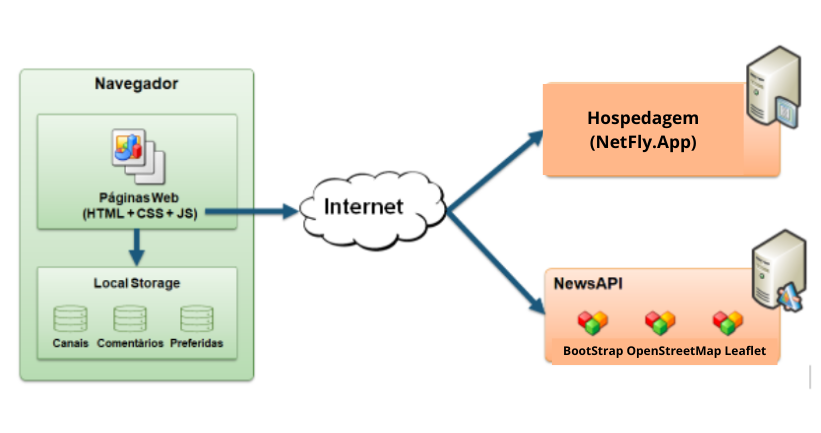
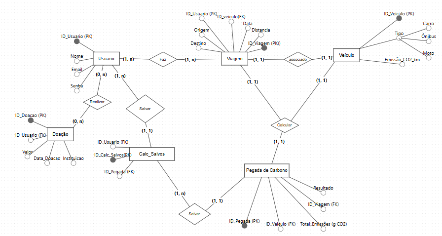
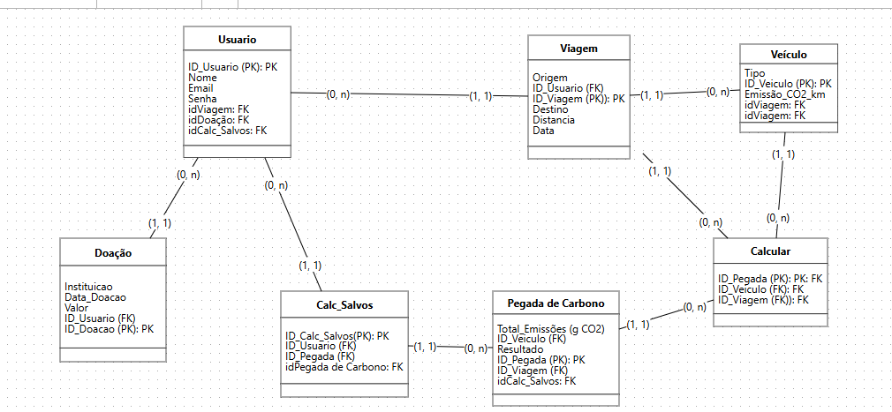

## 4. Projeto da Solução

A plataforma CarbonoPorKM foi concebida para promover a conscientização ambiental e educação sobre as emissões de dióxido de carbono (CO₂) produzidos pelos meios de transporte.

1. Front-end e Interatividade:
* O Bootstrap foi selecionado para oferecer um design responsivo e intuitivo, adaptável a vários dispositivos, proporcionando uma navegação fluida, tanto em desktops quanto em dispositivos móveis.
* A exibição de mapas interativos será feita por meio da biblioteca Leaflet, que, integrada com o OpenStreetMap (OSM), oferece dados geoespaciais gratuitos e precisos, permitindo calcular distâncias e, consequentemente, a pegada de carbono de cada usuário com base nas rotas inseridas.

2. APIs e Dados Geoespaciais:
* A API Nominatim, do OpenStreetMap, será usada para realizar a geocodificação e geocodificação reversa, transformando endereços em coordenadas geográficas e vice-versa. Isso torna a experiência do usuário mais intuitiva, já que ele poderá inserir endereços facilmente e obter resultados precisos.

3. Funcionalidade de Login e Acesso:
* A plataforma permitirá acesso tanto com login quanto sem login:
  * Usuários com login terão a possibilidade de salvar seus dados, como distâncias percorridas e resultados de pegada de carbono, além de realizar pesquisas personalizadas para doações em fundos ambientais.
  * Usuários sem login poderão usar o serviço sem salvar resultados, mas ainda poderão realizar cálculos da pegada de carbono de forma automática e receber sugestões sustentáveis com base nos dados inseridos.

4. Banco de Dados e Armazenamento de Dados:
* O MySQL foi escolhido como banco de dados, proporcionando uma solução robusta e escalável para armazenar os dados dos usuários logados, como históricos de cálculos e preferências para doações personalizadas. A estrutura do banco permitirá que o sistema expanda as funcionalidades de forma eficiente à medida que a base de usuários cresce

## 4.1. Arquitetura da solução

- **Páginas Web (HTML + CSS + JS):** Parte do front-end, representando o que os usuários interagem no navegador.
- **Local Storage:** Armazenamento local usado para guardar dados como canais, comentários e preferências diretamente no navegador do usuário.
- **Hospedagem (Netlify.app):** Serviço de deploy para hospedar o site.
- **NewsAPI:** API usada para buscar notícias em tempo real. Inclui tecnologias como:
  - Bootstrap: Framework CSS para facilitar o design responsivo.
  - OpenStreetMap: Serviço de mapas aberto, usado para exibir localizações.
  - Leaflet: Biblioteca JavaScript usada para mapear dados geográficos.
 
 
 

## 4.2. Protótipos de telas

## Processo 1: Registro da Conta

#### Detalhamento das atividades:
Para se cadastrar no site, a fim de obter acesso à seus resultados anteriores e personalizados, o usuário deverá entrar na página de registro e informar seus dados. Feito isso, serão registrados no sistema os dados de um novo usuário, e será possível fazer login com estes.

#### Atividade 1: Preencher formulário

| Campo | Tipo de Dado    | Restrições                                   | Valor Default |
|-------|------------------|----------------------------------------------|---------------|
| Nome  | Caixa de texto  | 1-40 caracteres                              |               |
| Email | Caixa de texto  | válido e não registrado no sistema           |               |
| Senha | Caixa de texto  | mínimo de 9 caracteres e pelo menos um número |               |

#### Comandos do Sistema

| Comandos        | Destinos                                                      | Tipo    |
|-----------------|---------------------------------------------------------------|---------|
| Registrar       | Validar dados, registrar usuário e encaminhar para página de usuário | default |
| Login (header)  | Página de login                                               | default |

## Processo 2: Cálculo da Pegada de Carbono sem Login

#### Detalhamento das atividades:
Será feito o cálculo da pegada de carbono e como o usuário está sem o login não irá se salvar o resultado somente mostrar na tela 

 #### Atividade 1: Inserir local de origem, destino e o tipo de veículo

| Campo           | Tipo de Dado       | Restrições            | Valor Default |
| --------------- | ------------------ | -------------------   | ------------- |
| Local de origem | Caixa de texto     | máximo 100 caracteres | Null          |
| Local de destino| Caixa de texto     | máximo 100 caracteres | Null          |
| Tipo de veículo | Lista com veículos | Somente uma escolha   | Null          |

| Comandos  | Destinos                     | Tipo    |
| :-------: | :--------------------------: | :-----: |
| Calcular  | Cálculo da pegada de carbono | default |

## Processo 3: Cálculo da Pegada de Carbono com login

#### Detalhamento da Atividade:
 Após fazer o login, o usuário preenche os dados necessários, o sistema fará o cálculo da pegada de carbono, e como o usuário está logado irá salvar o resultado no banco de dados e mostrar na tela.
 
#### Atividade 1: Usuário faz login no sistema
| Campo | Tipo de Dado    | Restrições        | Valor Default |
|-------|------------------|------------------|---------------|
| Email | Caixa de texto  | Valor obrigatório |               |
| Senha | Caixa de texto  | Valor obrigatório |               |

| Comandos        | Destinos                       | Tipo    |
|-----------------|--------------------------------|---------|
| Fazer login     | Usuário faz login no sistema   | default |

#### Atividade 2: Inserir local de origem, destino e o tipo de veículo

| Campo           | Tipo de Dado       | Restrições            | Valor Default |
| --------------- | ------------------ | -------------------   | ------------- |
| Local de origem | Caixa de texto     | máximo 100 caracteres | Null          |
| Local de destino| Caixa de texto     | máximo 100 caracteres | Null          |
| Tipo de veículo | Lista com veículos | Somente uma escolha   | Null          |

| Comandos | Destinos                       | Tipo    |
|----------|--------------------------------|---------|
| Calcular | Cálculo da pegada de carbono   | default |

## Processo 4: Fornecimento de Sugestões Sustentáveis sem login

#### Descrição da Atividade:
Será mostrado as sugestões de soluções sustentáveis, onde por o usuario não estar logado o sistema irá exibir uma lista pré definida.

## Processo 5: Fornecimento de Sugestões Sustentáveis ​​com Login 

#### Detalhamento da Atividade:
 O sistema busca no banco de dados as preferências do usuário, e gera sugestões a partir destas. O sistema mostra na tela um aviso, perguntando se o usuário quer ou não salvar as sugestões mostradas. O usuário pode aceitar ou não, se aceitar, as sugestões são salvas no banco de dados. 

#### Atividade 1: Salvar Sugestões
| Comandos         | Destinos                       | Tipo    |
|------------------|--------------------------------|---------|
| Salvar sugestões | Salvar ou não as sugestões     | boolean |

## Processo 6: Doação para Compensação de Emissões (Sem Login)

#### Detalhamento da Atividade:
Esse processo o usuario sem login será redirecionado para sua instituição de escolha.

#### Atividade 1: Doar (sem login) 

| Campo       | Tipo de Dado   | Restrições                          | Valor Default |
|-------------|----------------|-------------------------------------|---------------|
| Sugestão    | Texto/Lista    | Link de algum dos colaboradores     | Null          |
| Instituição | Texto/Lista    | Nome da instituição cadastrada no site | Null      |
| Valor       | Double/Float   | Tem que ser em reais                | Null          |

| Comandos  | Destinos                                     | Tipo     |
|-----------|---------------------------------------------|----------|
| Abrir link | O usuário abre o link da instituição escolhida | default |

## Processo 7: Doação para Compensação de Emissões (Com login)

#### Detalhamento da Atividade:
O usuario irá escolher a instuição e o valor que quer doar para nosso site fazer a doação em seu nome.

#### Atividade 1: Doar para as instituições 

| Campo       | Tipo de Dado   | Restrições                          | Valor Default |
|-------------|----------------|-------------------------------------|---------------|
| Sugestão    | Texto/Lista    | Link de algum dos colaboradores     | Null          |
| Instituição | Texto/Lista    | Nome da instituição cadastrada no site | Null      |
| Valor       | Double/Float   | Tem que ser em reais                | Null          |

| Comandos  | Destinos                                     | Tipo     |
|-----------|---------------------------------------------|----------|
| Inserir valor| Usuário coloca o valor de quanto quer doar | default |
| Doar | usuário clica para doar o valor colocado | default |

### 4.3. Modelo de dados

#### 4.3.1 Modelo ER

#### 4.3.2 Esquema Relacional

#### 4.3.3 Modelo Físico

<code>

CREATE TABLE Usuario 
(
    ID_Usuario INT PRIMARY KEY,
    Nome VARCHAR(100) NOT NULL,  
    Email VARCHAR(100) NOT NULL,  
    Senha VARCHAR(100) NOT NULL,  
    idCalc_Salvos INT
);

CREATE TABLE Veiculo 
(
    ID_Veiculo INT PRIMARY KEY,
    Tipo VARCHAR(50) NOT NULL,  
    Emissao_CO2_km DECIMAL(10, 2) NOT NULL
);

CREATE TABLE Viagem 
(
    ID_Viagem INT PRIMARY KEY,  
    Origem VARCHAR(100) NOT NULL,  
    Destino VARCHAR(100) NOT NULL,  
    Distancia DECIMAL(10, 2) NOT NULL,  
    Data DATE NOT NULL,  
    ID_Usuario INT,
    ID_Veiculo INT,
    FOREIGN KEY (ID_Usuario) REFERENCES Usuario(ID_Usuario),
    FOREIGN KEY (ID_Veiculo) REFERENCES Veiculo(ID_Veiculo)
);

CREATE TABLE Pegada_Carbono (
    ID_Pegada INT PRIMARY KEY,  
    Total_Emissoes_gCO2 DECIMAL(10, 2) NOT NULL,  
    Resultado DECIMAL(10, 2) NOT NULL,  
    ID_Viagem INT NOT NULL,
    idCalc_Salvos INT,
    FOREIGN KEY (ID_Viagem) REFERENCES Viagem(ID_Viagem)
);

CREATE TABLE Doacao (
    ID_Doacao INT PRIMARY KEY,  
    Instituicao VARCHAR(100) NOT NULL,  
    Data_Doacao DATE NOT NULL,  
    Valor DECIMAL(10, 2) NOT NULL,  
    ID_Usuario INT,
    FOREIGN KEY (ID_Usuario) REFERENCES Usuario(ID_Usuario)
)

</code>

[Exemplos de uso das tabelas](6a-Tabelas.md) 

### 4.4. Tecnologias

#### Linguagens de Programação:
**HTML/CSS/JavaScript:** Para a construção da interface do usuário (UI) e a interatividade do site.
**PHP:** Usado para desenvolvimento backend, gerenciamento de requisições e integração com o banco de dados MySQL.
**SQL:** Linguagem de consulta usada para interagir com o banco de dados MySQL.

#### Frameworks e Bibliotecas:
**Bootstrap:** Framework de CSS utilizado para criar interfaces responsivas e otimizadas para diferentes dispositivos.
**Leaflet:** Biblioteca JavaScript para criação de mapas interativos e visualização das rotas percorridas pelos usuários.
**OpenStreetMap (OSM) e API Nominatim:** Usados para fornecer dados geoespaciais, permitindo o cálculo de distâncias entre dois pontos.

#### Banco de Dados:
**MySQL:** Sistema de gerenciamento de banco de dados relacional, usado para armazenar dados de usuários, trajetos, doações e preferências.

#### Ferramentas de Desenvolvimento:
**Figma:** Utilizado para o design e prototipagem da interface, facilitando a visualização de fluxos e layouts antes da implementação.
**GitHub:** Plataforma para controle de versão e colaboração entre a equipe de desenvolvimento, hospedando o código-fonte e facilitando o gerenciamento de branches e merges.
**Visual Studio Code:** IDE principal para a codificação do projeto, com integração com GitHub para controle de versão e plug-ins para facilitar o desenvolvimento em PHP, JavaScript, etc.

#### Hospedagem e Infraestrutura:
**A DECIDIR!**
