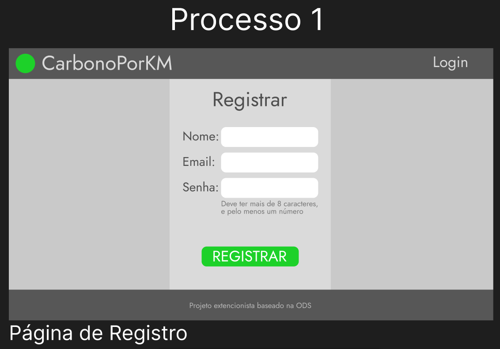
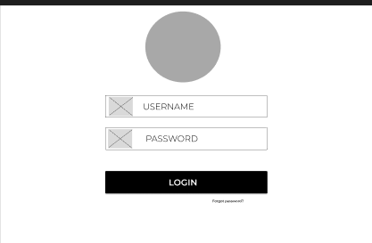
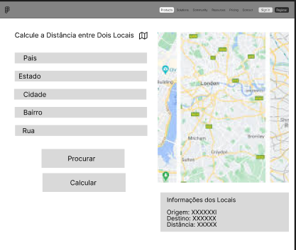
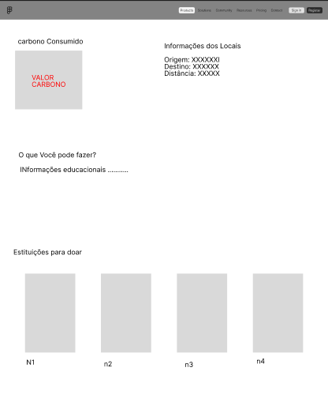
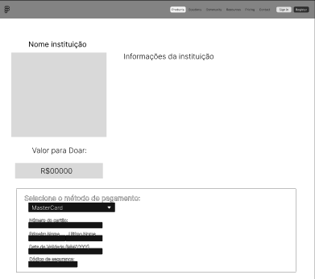
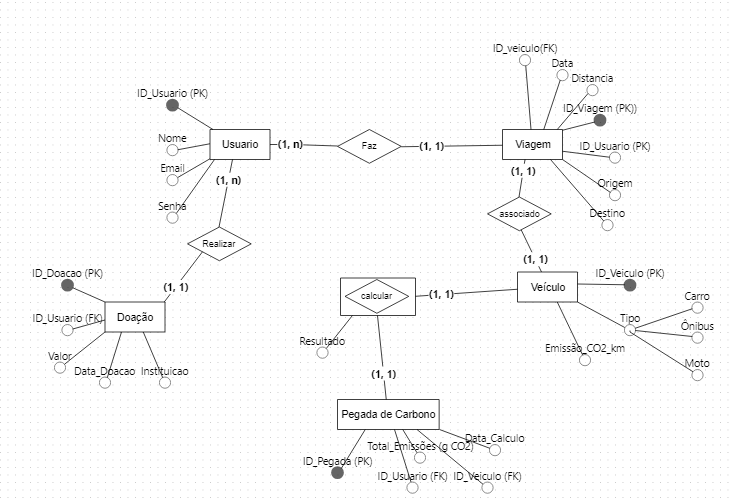

## 4. Projeto da Solução

A plataforma CarbonoPorKM foi concebida para promover a conscientização ambiental e educação sobre as emissões de dióxido de carbono (CO₂) produzidos pelos meios de transporte.

1. Front-end e Interatividade:
* O Bootstrap foi selecionado para oferecer um design responsivo e intuitivo, adaptável a vários dispositivos, proporcionando uma navegação fluida, tanto em desktops quanto em dispositivos móveis.
* A exibição de mapas interativos será feita por meio da biblioteca Leaflet, que, integrada com o OpenStreetMap (OSM), oferece dados geoespaciais gratuitos e precisos, permitindo calcular distâncias e, consequentemente, a pegada de carbono de cada usuário com base nas rotas inseridas.

2. APIs e Dados Geoespaciais:
* A API Nominatim, do OpenStreetMap, será usada para realizar a geocodificação e geocodificação reversa, transformando endereços em coordenadas geográficas e vice-versa. Isso torna a experiência do usuário mais intuitiva, já que ele poderá inserir endereços facilmente e obter resultados precisos.

3. Funcionalidade de Login e Acesso:
* A plataforma permitirá acesso tanto com login quanto sem login:
  * Usuários com login terão a possibilidade de salvar seus dados, como distâncias percorridas e resultados de pegada de carbono, além de realizar pesquisas personalizadas para doações em fundos ambientais.
  * Usuários sem login poderão usar o serviço sem salvar resultados, mas ainda poderão realizar cálculos da pegada de carbono de forma automática e receber sugestões sustentáveis com base nos dados inseridos.

4. Banco de Dados e Armazenamento de Dados:
* O MySQL foi escolhido como banco de dados, proporcionando uma solução robusta e escalável para armazenar os dados dos usuários logados, como históricos de cálculos e preferências para doações personalizadas. A estrutura do banco permitirá que o sistema expanda as funcionalidades de forma eficiente à medida que a base de usuários cresce

## 4.1. Arquitetura da solução

......  COLOQUE AQUI O SEU TEXTO E O DIAGRAMA DE ARQUITETURA .......

 Inclua um diagrama da solução e descreva os módulos e as tecnologias
 que fazem parte da solução. Discorra sobre o diagrama.
 
 **Exemplo do diagrama de Arquitetura**:
 
 
 

### 4.2. Protótipos de telas

#### Processo 1: Registro da Conta

#### Processo 2: Acessar Conta

#### Processo 3: Cálculo da Pegada de Carbono

#### Processo 4: Fornecimento de Sugestões Sustentáveis

#### Processo 6 e 7: Doação para Compensação de Emissões

## Diagrama de Classes

O diagrama de classes ilustra graficamente como será a estrutura do software, e como cada uma das classes da sua estrutura estarão interligadas. Essas classes servem de modelo para materializar os objetos que executarão na memória.

As referências abaixo irão auxiliá-lo na geração do artefato “Diagrama de Classes”.

> - [Diagramas de Classes - Documentação da IBM](https://www.ibm.com/docs/pt-br/rational-soft-arch/9.6.1?topic=diagrams-class)
> - [O que é um diagrama de classe UML? | Lucidchart](https://www.lucidchart.com/pages/pt/o-que-e-diagrama-de-classe-uml)

## Modelo ER

### 4.3. Modelo de dados

O desenvolvimento da solução proposta requer a existência de bases de dados que permitam efetuar os cadastros de dados e controles associados aos processos identificados, assim como recuperações.
Utilizando a notação do DER (Diagrama Entidade e Relacionamento), elaborem um modelo, na ferramenta visual indicada na disciplina, que contemple todas as entidades e atributos associados às atividades dos processos identificados. Deve ser gerado um único DER que suporte todos os processos escolhidos, visando, assim, uma base de dados integrada. O modelo deve contemplar, também, o controle de acesso de usuários (partes interessadas dos processos) de acordo com os papéis definidos nos modelos do processo de negócio.
_Apresente o modelo de dados por meio de um modelo relacional que contemple todos os conceitos e atributos apresentados na modelagem dos processos._

#### 4.3.1 Modelo ER

O Modelo ER representa através de um diagrama como as entidades (coisas, objetos) se relacionam entre si na aplicação interativa.]

As referências abaixo irão auxiliá-lo na geração do artefato “Modelo ER”.

> - [Como fazer um diagrama entidade relacionamento | Lucidchart](https://www.lucidchart.com/pages/pt/como-fazer-um-diagrama-entidade-relacionamento)

#### 4.3.2 Esquema Relacional

O Esquema Relacional corresponde à representação dos dados em tabelas juntamente com as restrições de integridade e chave primária.
 
As referências abaixo irão auxiliá-lo na geração do artefato “Esquema Relacional”.

> - [Criando um modelo relacional - Documentação da IBM](https://www.ibm.com/docs/pt-br/cognos-analytics/10.2.2?topic=designer-creating-relational-model)

---

#### 4.3.3 Modelo Físico

Insira aqui o script de criação das tabelas do banco de dados.

Veja um exemplo:

<code>

 -- Criação da tabela Médico
CREATE TABLE Medico (
    MedCodigo INTEGER PRIMARY KEY,
    MedNome VARCHAR(100)
);

-- Criação da tabela Paciente
CREATE TABLE Paciente (
    PacCodigo INTEGER PRIMARY KEY,
    PacNome VARCHAR(100)
);

-- Criação da tabela Consulta
CREATE TABLE Consulta (
    ConCodigo INTEGER PRIMARY KEY,
    MedCodigo INTEGER,
    PacCodigo INTEGER,
    Data DATE,
    FOREIGN KEY (MedCodigo) REFERENCES Medico(MedCodigo),
    FOREIGN KEY (PacCodigo) REFERENCES Paciente(PacCodigo)
);

-- Criação da tabela Medicamento
CREATE TABLE Medicamento (
    MdcCodigo INTEGER PRIMARY KEY,
    MdcNome VARCHAR(100)
);

-- Criação da tabela Prescricao
CREATE TABLE Prescricao (
    ConCodigo INTEGER,
    MdcCodigo INTEGER,
    Posologia VARCHAR(200),
    PRIMARY KEY (ConCodigo, MdcCodigo),
    FOREIGN KEY (ConCodigo) REFERENCES Consulta(ConCodigo),
    FOREIGN KEY (MdcCodigo) REFERENCES Medicamento(MdcCodigo)
);

</code>

Este script deverá ser incluído em um arquivo .sql na pasta src\bd.

### 4.4. Tecnologias

#### Linguagens de Programação:
**HTML/CSS/JavaScript:** Para a construção da interface do usuário (UI) e a interatividade do site.
**PHP:** Usado para desenvolvimento backend, gerenciamento de requisições e integração com o banco de dados MySQL.
**SQL:** Linguagem de consulta usada para interagir com o banco de dados MySQL.

#### Frameworks e Bibliotecas:
**Bootstrap:** Framework de CSS utilizado para criar interfaces responsivas e otimizadas para diferentes dispositivos.
**Leaflet:** Biblioteca JavaScript para criação de mapas interativos e visualização das rotas percorridas pelos usuários.
**OpenStreetMap (OSM) e API Nominatim:** Usados para fornecer dados geoespaciais, permitindo o cálculo de distâncias entre dois pontos.

#### Banco de Dados:
**MySQL:** Sistema de gerenciamento de banco de dados relacional, usado para armazenar dados de usuários, trajetos, doações e preferências.

#### Ferramentas de Desenvolvimento:
**Figma:** Utilizado para o design e prototipagem da interface, facilitando a visualização de fluxos e layouts antes da implementação.
**GitHub:** Plataforma para controle de versão e colaboração entre a equipe de desenvolvimento, hospedando o código-fonte e facilitando o gerenciamento de branches e merges.
**Visual Studio Code:** IDE principal para a codificação do projeto, com integração com GitHub para controle de versão e plug-ins para facilitar o desenvolvimento em PHP, JavaScript, etc.

#### Hospedagem e Infraestrutura:
**A DECIDIR!**

