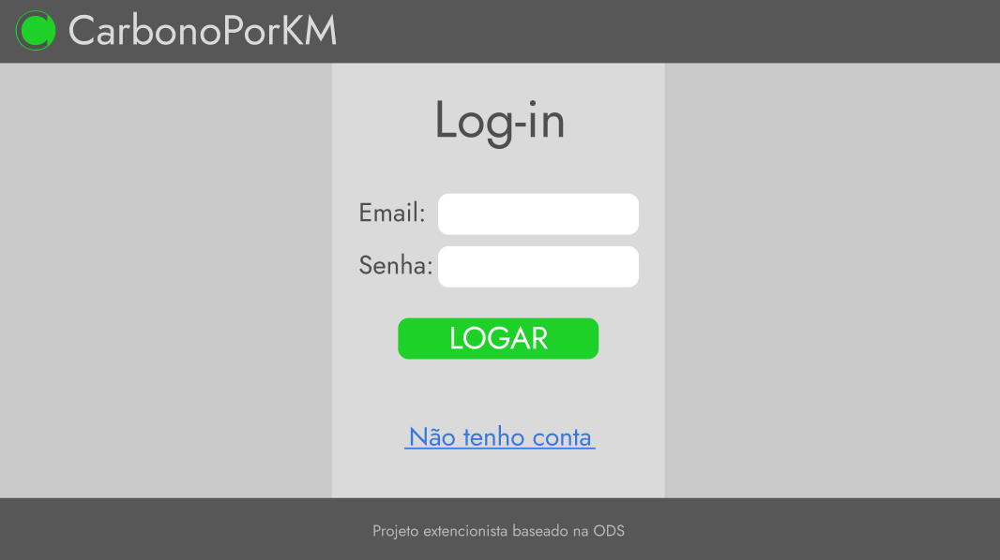
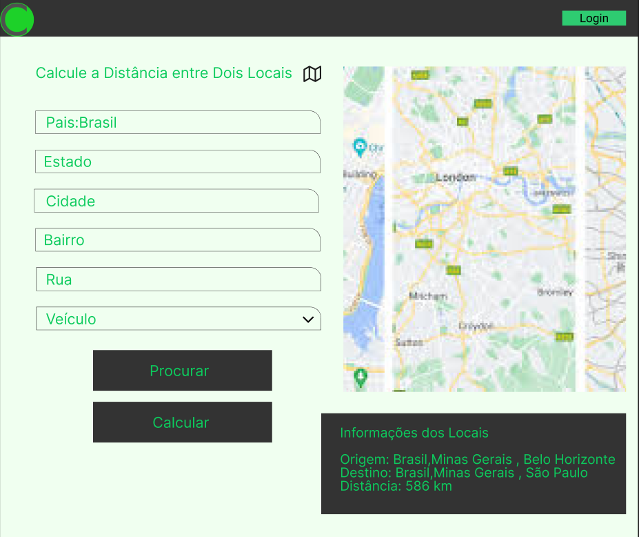
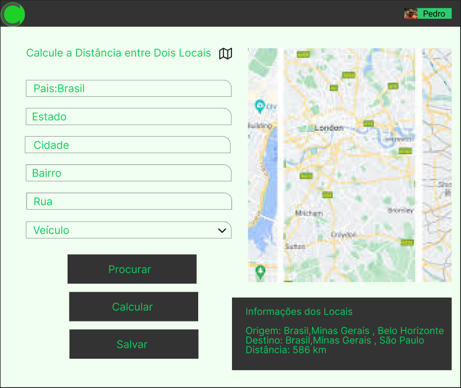

# 6. Interface do Sistema

_Visão geral da interação do usuário por meio das telas do sistema._

## 6.1.0 Tela principal do sistema

_Esta tela apresenta uma breve descrição do objetivo do site, com uma opção de fazer log-in e uma opção para calcular a pegada._

## 6.1.1 Telas do processo 1

Nesta página o usuário pode preencher os campos com seus dados de nome, email e senha, para registra-lo no sistema.

## 6.1.2 Telas do processo 2

Nesta página o usuário insere os dados de dois locais, calculando a distância entre eles em Km, seguindo rotas automobilisticas, e o veículo que utiliza nessa rota, para posteriormente fazer o calculo da pegada.

## 6.1.3. Telas do processo 3

Nesta página o usuário insere os dados de dois locais, calculando a distância entre eles em Km, seguindo rotas automobilisticas, e o veículo que utiliza nessa rota, para posteriormente fazer o calculo da pegada. Por estar logado no site, é gerado um novo registro do elemento Viagens no banco de dados, para posteriormente poder ser salvo.

## 6.1.4 Telas do processo 4

Nesta página é calculado o valor da pegada de carbono do usuário, assim como as outras informações que inseriu. Em seguida, o site escolhe, de acordo com as informações dadas, melhores alternativas para diminuir esta pegada, se possível, além de instituições que contribuem para a causa, caso o usuário tiver interesse de fazer uma doação.

## 6.1.5. Telas do processo 5

Nesta página é calculado o valor da pegada de carbono do usuário, assim como as outras informações que inseriu. Em seguida, o site escolhe, de acordo com as informações dadas, melhores alternativas para diminuir esta pegada, se possível, além de instituições que contribuem para a causa, caso o usuário tiver interesse de fazer uma doação. Por estar logado, o usuário poderá escolher entre salvar ou não este resultado para visualizar posteriormente.

(Página onde os resultados salvos são exibidos)

## 6.1.6 Telas do processo 6

Nesta página, após selecionar a instituição que tem interesse em fazer uma doação, é exibido mais informações a respeito da instituição, e um local designado para pagamento, onde se define o valor e o método de pagamento, para doar à mesma instituição. Esta doação será anônima.

## 6.1.6 Telas do processo 7

Nesta página, após selecionar a instituição que tem interesse em fazer uma doação, é exibido mais informações a respeito da instituição, e um local designado para pagamento, onde se define o valor e o método de pagamento, para doar à mesma instituição. Por estar logado, esta doação estará associada a seu nome.

# 6.2 Indicadores

## Doações feitas por viagem Geral
- Medida: Porcentagem
- Prioridade de cálculo: ??
- Responsável: Administrador do site
- Fórmula: Quantidade total de doações / Quantidade total de viagens
- Realizar mensalmente por 4 meses
- Variáveis: Quantidade total de doações, Quantidade total de viagens
- O total de doações pode ser adquirido através do comando COUNT(DISTINCT ID_Doacao) com a tabela Doacao; E a quantidade total de viagens pode ser adquirida através do comando COUNT(DISTINCT ID_Viagem) com a tabela Viagem
- Para qualquer usuário

## Média de Tráfego geral
- Medida: Quantidade de viagens por mês
- Prioridade de cálculo: ??
- Responsável: Administrador do site
- Fórmula: Quantidade(Viagens)/(Quantidade de meses do site no ar)
- Realizar mensalmente por um ano
- Variáveis: Quantidade distinta de viagens armazenado no banco de dados, quantidade de meses em que o site está no ar
- A quantidade total de viagens pode ser adquirida através do comando COUNT(DISTINCT ID_Viagem) com a tabela Viagem. Quantidade de meses é adquirida pela formula: Mês atual - Mês de inicio + ((Ano atual - Ano de inicio)*12)
- Para qualquer usuário

## Doações feitas por viagem para usuários logados
- Medida: Porcentagem
- Prioridade de cálculo: ??
- Responsável: Administrador do site
- Fórmula: Quantidade total de doações de usuários logados / Quantidade total de viagens de usuários logados
- Realizar mensalmente por 4 meses
- Variáveis: Quantidade total de doações, Quantidade total de viagens
- O total de doações pode ser adquirido através do comando COUNT(DISTINCT ID_Doacao) com a tabela Doacao, **onde ID_Usuario não é nulo**; E a quantidade total de viagens pode ser adquirida através do comando COUNT(DISTINCT ID_Viagem) com a tabela Viagem, **onde ID_Usuario não é nulo**
- Para usuários que possuem conta

## Média de Tráfego geral para usuários logados
- Medida: Quantidade de viagens por mês
- Prioridade de cálculo: ??
- Responsável: Administrador do site
- Fórmula: Quantidade total de viagens de usuários logados/(Quantidade de meses do site no ar)
- Realizar mensalmente por um ano
- Variáveis: Quantidade distinta de viagens armazenado no banco de dados, quantidade de meses em que o site está no ar
- A quantidade total de viagens pode ser adquirida através do comando COUNT(DISTINCT ID_Viagem) com a tabela Viagem, **onde ID_Usuario não é nulo**. Quantidade de meses é adquirida pela formula: Mês atual - Mês de inicio + ((Ano atual - Ano de inicio)*12)
- Para usuários que possuem conta 

