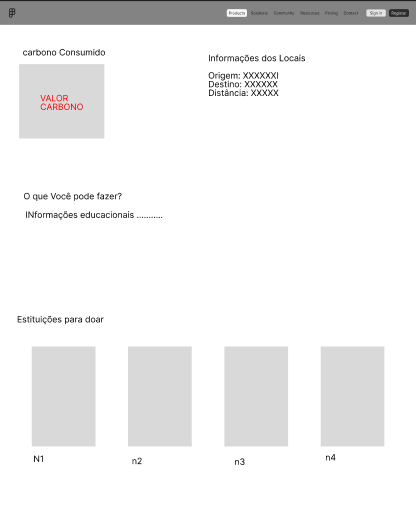
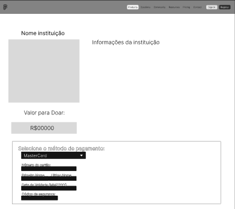

# 6. Interface do Sistema

Pré-requisitos: <a href="4-Projeto-Solucao.md"> Projeto da Solução</a>

_Visão geral da interação do usuário por meio das telas do sistema. Apresente as principais interfaces da plataforma._

## 6.1.1 Tela principal do sistema

_Esta tela apresenta uma breve descrição do objetivo do site, com uma opção de fazer log-in e uma opção para calcular a pegada._

## 6.1.2. Telas do processo 1

_Nesta página o usuário pode preencher os campos com seus dados de nome, email e senha, para registra-lo no sistema._

## 6.1.3. Telas do processo 2

_Descrição da tela relativa à atividade 1._

_Descrição da tela relativa à atividade 2._

[`Tela da atividade 2`](images/)

## 6.1.3. Telas do processo 3

_Descrição da tela relativa à atividade 1._

_Descrição da tela relativa à atividade 2._

[`Tela da atividade 2`](images/)

## 6.1.3. Telas do processo 4

_Descrição da tela relativa à atividade 1._

_Descrição da tela relativa à atividade 2._

[`Tela da atividade 2`](images/)

## 6.1.3. Telas do processo 5

_Descrição da tela relativa à atividade 1._

_Descrição da tela relativa à atividade 2._

[`Tela da atividade 2`](images/)

