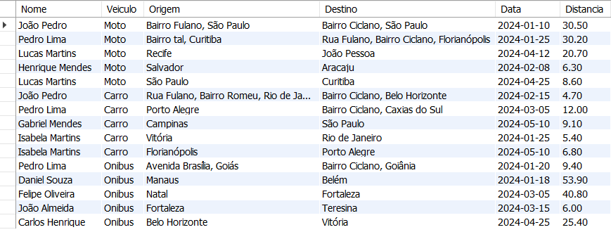

<h1> INSERÇÃO DE DADOS </h1>

INSERT INTO Usuario (ID_Usuario, Nome, Email, Senha, idCalc_Salvos) VALUES 
(1, 'João Pedro', 'joao.pedro@email.com', 'senha1234', 101),
(2, 'Pedro Lima', 'pedro.lima@email.com', 'senha4567', 102),
(3, 'Carlos Henrique', 'carlos.henrique@email.com', 'senha7890', 103),
(4, 'Daniel Souza', 'daniel.souza@email.com', 'senhaabcd', 104),
(5, 'Lucas Martins', 'lucas.martins@email.com', 'senhadefg', 105),
(6, 'Felipe Oliveira', 'felipe.oliveira@email.com', 'senha4321', 106),
(7, 'Gabriel Mendes', 'gabriel.mendes@email.com', 'senha8765', 107),
(8, 'Henrique Mendes', 'henrique.mendes@email.com', 'senha91011', 108),
(9, 'Isabela Martins', 'isabela.martins@email.com', 'senha1213', 109),
(10, 'João Almeida', 'joao.almeida@email.com', 'senha1415', 110);

INSERT INTO Veiculo (ID_Veiculo, Tipo, Emissao_CO2_km) VALUES
(1, 'Moto', 1.2),
(2, 'Carro', 1.6),
(3, 'Onibus', 2.5);

INSERT INTO Viagem (ID_Viagem, Origem, Destino, Distancia, Data, ID_Usuario, ID_Veiculo) VALUES 
(1, 'Bairro Fulano, São Paulo', 'Bairro Ciclano, São Paulo', 30.5, '2024-01-10', 1, 1),
(2, 'Rua Fulano, Bairro Romeu, Rio de Janeiro', 'Bairro Ciclano, Belo Horizonte', 4.7, '2024-02-15', 1, 2),
(3, 'Bairro tal, Curitiba', 'Rua Fulano, Bairro Ciclano, Florianópolis', 30.2, '2024-01-25', 2, 1),
(4, 'Avenida Brasília, Goiás', 'Bairro Ciclano, Goiânia', 9.4, '2024-01-20', 2, 3),
(5, 'Porto Alegre', 'Bairro Ciclano, Caxias do Sul', 12.0, '2024-03-05', 2, 2),
(6, 'Manaus', 'Belém', 53.9, '2024-01-18', 4, 3),
(7, 'Recife', 'João Pessoa', 20.7, '2024-04-12', 5, 1),
(8, 'Natal', 'Fortaleza', 40.8, '2024-03-05', 6, 3),
(9, 'Campinas', 'São Paulo', 9.1, '2024-05-10', 7, 2),
(10, 'Salvador', 'Aracaju', 6.3, '2024-02-08', 8, 1),
(11, 'Vitória', 'Rio de Janeiro', 5.4, '2024-01-25', 9, 2),
(12, 'Fortaleza', 'Teresina', 6.0, '2024-03-15', 10, 3),
(13, 'Belo Horizonte', 'Vitória', 25.4, '2024-04-25', 3, 3),
(14, 'São Paulo', 'Curitiba', 8.6, '2024-04-25', 5, 1),
(15, 'Florianópolis', 'Porto Alegre', 6.8, '2024-05-10', 9, 2);

INSERT INTO Pegada_Carbono (ID_Pegada, Total_Emissoes_gCO2, Resultado, ID_Viagem, idCalc_Salvos) VALUES 
(1, 21525.0, 50.1, 1, 101),
(2, 18748.5, 45.3, 2, 101),
(3, 15010.0, 30.0, 3, 102),
(4, 10582.0, 25.6, 4, 102),
(5, 7680.0, 15.8, 5, 103),
(6, 26925.5, 60.0, 6, 104),
(7, 5543.0, 12.3, 7, 105),
(8, 29987.2, 65.5, 8, 106),
(9, 4951.2, 10.7, 9, 107),
(10, 18725.4, 42.1, 10, 108),
(11, 23463.2, 52.8, 11, 109),
(12, 28935.0, 60.9, 12, 110),
(13, 26012.3, 55.5, 13, 103),
(14, 18952.4, 45.2, 14, 105),
(15, 22580.0, 50.5, 15, 109);

INSERT INTO Doacao (ID_Doacao, Instituicao, Data_Doacao, Valor, ID_Usuario) VALUES 
(1, 'Instituto Verde', '2024-01-05', 150.0, 1),
(2, 'Planeta Limpo', '2024-03-07', 200.0, 1),
(3, 'Árvore do Futuro', '2024-02-12', 120.0, 5),
(4, 'Fundo Amazônia', '2024-04-20', 250.0, 5),
(5, 'Coração Verde', '2024-03-15', 100.0, 5),
(6, 'Instituto EcoVida', '2024-05-10', 180.0, 5),
(7, 'Planeta Limpo', '2024-02-25', 130.0, 6),
(8, 'Verde Esperança', '2024-03-30', 170.0, 9),
(9, 'Salve o Verde', '2024-01-28', 160.0, 9),
(10, 'Mundo Sustentável', '2024-04-12', 190.0, 9)

<h1> EXEMPLOS DE REGISTROS </h1>

<h2> 1- Consulta de todos os usuários, mostrando seu nome, email, quantidade de pegadas salvas e quantidade de doações, ordenado de forma decrescente de acordo com esta.</h2>

SELECT u.Nome, u.Email, Count(DISTINCT p.ID_Pegada) AS Pegadas_Salvas, Count(DISTINCT d.ID_Doacao) AS Doacoes_Feitas
FROM Usuario u
LEFT JOIN Pegada_Carbono p ON u.idCalc_Salvos = p.idCalc_Salvos
LEFT JOIN Doacao d ON u.ID_Usuario = d.ID_Usuario
GROUP BY u.Nome
ORDER BY 4 DESC

<h2> 2- Consulta de todas as viagens e suas informações relevantes  (Nome, Veiculo, Distancia, Origem, Destino e Data)</h2>

SELECT u.Nome, ve.Tipo AS Veiculo, vi.Origem, vi.Destino, vi.Data, vi.Distancia
FROM Usuario u
JOIN Viagem vi ON vi.ID_Usuario = u.ID_Usuario
JOIN Veiculo ve ON vi.ID_Veiculo = ve.ID_Veiculo

