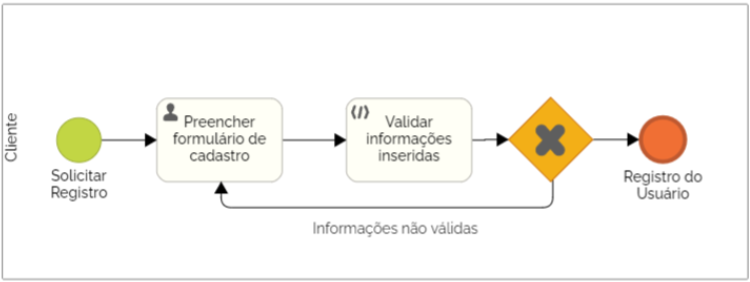

## 3.3.1 Processo 1 – Registro da Conta

### Descrição do Processo:
O usuário acessa a página de registro e insere suas informações pessoais, como nome, e-mail e senha. Após a verificação dos dados, o sistema cria uma conta única para o usuário, permitindo que ele acesse funcionalidades exclusivas, como o cálculo personalizado da pegada de carbono e a possibilidade de salvar e verificar os resultados. 
Modelagem do Processo (BPMN): 
Início : O usuário solicita o registro. 
Passo 1 : Usuário preenche o formulário de cadastro. 
Passo 2 : O sistema valida as informações (e-mail válido, senha forte). 
Passo 3 : Criação da conta no banco de dados. 
Fim : Usuário registrado com sucesso. 
Oportunidades de Melhoria:  
Implementação de validação automática de campos (ex: formatação de e-mail, força de senha). 
Integração de CAPTCHA para prevenir bots no registro. 

