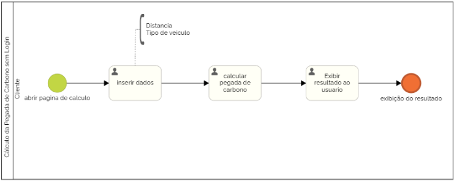

## 3.3.2 Processo 2: Cálculo da Pegada de Carbono sem Login  

### Descrição do Processo:
Usuários não registrados podem acessar a funcionalidade básica de cálculo da pegada de carbono. Eles inserem a distância diária percorrida e o tipo de veículo, e o sistema retorna a quantidade de CO₂ emitida, sem salvar os dados.  
Modelagem do Processo (BPMN): 
Início : O usuário acessa a página de cálculo sem login. 
Passo 1 : Insira a distância percorrida e o tipo de veículo. 
Passo 2 : O sistema calcula a pegada de carbono com base em fórmulas predefinidas. 
Passo 3 : Exibe o resultado ao usuário. 
Fim : O resultado é apresentado sem salvar dados.  
Oportunidades de Melhoria: 
Oferecer um botão de registro para salvar os cálculos, incentivando mais engajamento. 
Implementação de gráficos sonoros para ilustrar o impacto ambiental. 

 

