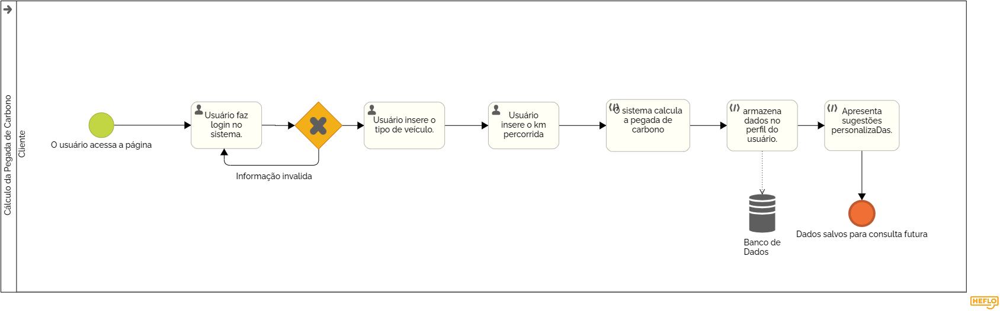

### 3.3.3 Processo 3: Cálculo da Pegada de Carbono com Login 

### Descrição do Processo:
Os usuários logados podem realizar o cálculo de sua pegada de carbono de maneira personalizada. Os dados inseridos são armazenados para permitir futuras pesquisas e comparação de resultados ao longo do tempo.  
Modelagem do Processo (BPMN): 
Início : Usuário faz login no sistema. 
Passo 1 : O usuário insere a distância percorrida e o tipo de veículo. 
Passo 2 : O sistema calcula a pegada de carbono e armazena os dados no perfil do usuário. 
Passo 3 : O resultado é apresentado junto com sugestões personalizadas. 
Fim : Dados salvos para consulta futura.  
Oportunidades de Melhoria: 
Oferecer um painel com histórico de pegada de carbono, permitindo a comparação de emissões ao longo do tempo.
Personalização de recomendações com base nos resultados passados ​​do usuário. 

 

## Detalhamento da Atividade:
 Será feito o cálculo da pegada de carbono e como o usuário está logado irá salvar o resultado no banco de dados é mostrar na tela.
 
### Atividade 1: Usuário faz login no sistema
| Campo | Tipo de Dado    | Restrições        | Valor Default |
|-------|------------------|------------------|---------------|
| Email | Caixa de texto  | Valor obrigatório |               |
| Senha | Caixa de texto  | Valor obrigatório |               |

| Comandos        | Destinos                       | Tipo    |
|-----------------|--------------------------------|---------|
| Fazer login     | Usuário faz login no sistema   | default |

### Atividade 2: Inserir a distância percorrida e o tipo de veículo

| Campo           | Tipo de Dado       | Restrições          | Valor Default |
|-----------------|--------------------|---------------------|---------------|
| Distância       | Número (decimal)   | Somente um valor    |               |
| Tipo de veículo | Lista com veículos | Somente uma escolha |               |

| Comandos | Destinos                       | Tipo    |
|----------|--------------------------------|---------|
| Calcular | Cálculo da pegada de carbono   | default |

