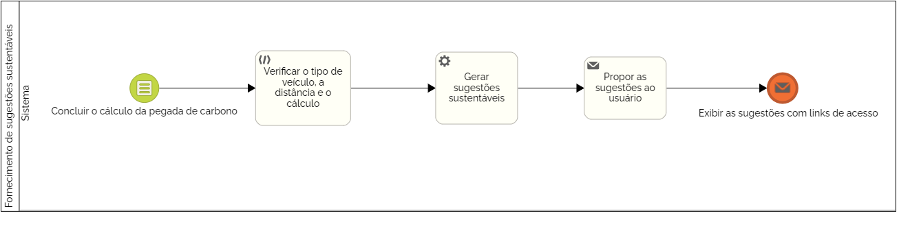

## 3.3.4 Processo 4: Fornecimento de Sugestões Sustentáveis
### Descrição do Processo:
Após o projeto da pegada de carbono, o sistema oferece sugestões de práticas sustentáveis ​​para reduzir as emissões. Essas sugestões são fundamentadas no tipo de transporte utilizado pelo usuário e nas distâncias percorridas.   
Modelagem do Processo (BPMN): 
Início : O cálculo da pegada de carbono é concluído. 
Passo 1 : O sistema verifica o tipo de veículo,distância e o cálculo. 
Passo 2 : Sugestões sustentáveis ​​são geradas (ex:fazer doações, caronas, veículos elétricos). 
Passo 3 : As sugestões são propostas ao usuário  
Fim : Sugestões exibidas com links de acesso.. 

 

Oportunidades de Melhoria: 
Classificação das sugestões por impacto (ex: baixa, média, alta redução de CO₂). 
Feedback do usuário sobre as sugestões, permitindo ajustar recomendações futuras. 

## Descrição da Atividade:
Será mostrado as sugestões de soluções sustentáveis onde por o usuario não estar logado o sistema irá exibir uma lista pré definida   

