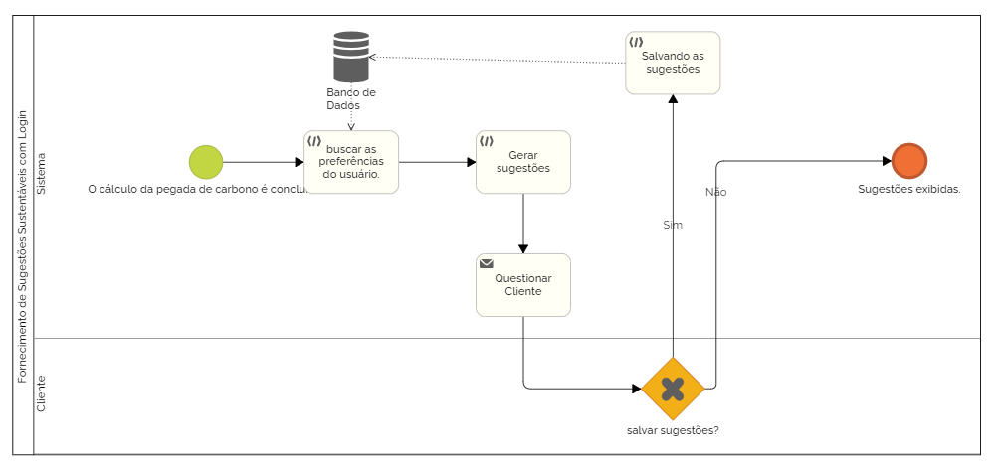

## 3.3.5 Processo 5: Fornecimento de Sugestões Sustentáveis ​​com Login  

### Descrição do Processo:
Usuários logados recebem sugestões sugestivas personalizadas, baseadas no histórico de cálculos de pegada de carbono, podendo salvar as sugestões para análise posterior.  
Modelagem do Processo (BPMN): 
Início :  O cálculo da pegada de carbono é concluído. 
Passo 1 : O sistema acessa as preferências do usuário 
Passo 2 : Sugestões personalizadas são geradas com base nos dados anteriores. 
Passo 3 : O usuário pode salvar e revisar as sugestões posteriormente se quiser. 
Fim : Sugestões exibidas.  
Oportunidades de Melhoria: 
Ofereça um plano de ação para que o usuário siga e acompanhe as mudanças em suas práticas de transporte. 
Gamificação : Recompensas para usuários que seguem as sugestões. 

