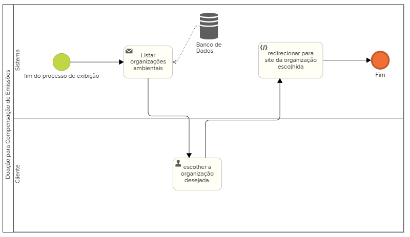

## 3.3.6 Processo 6: Doação para Compensação de Emissões (Sem Login) 

### Descrição do Processo: 
Usuários não registrados podem acessar a opção de fazer, mas o site os redireciona para sites externos de organizações de caridade ambiental.
Modelagem do Processo (BPMN): 
Início : Ao fim do processo de exibição  
Passo 1 : O sistema gera uma lista de organizações ambientais. 
Passo 2 : O usuário escolhe a organização desejada. 
Passo 3 : O sistema é redirecionado para o site da organização. 
Fim : Usuário sai do sistema. 

 

# Oportunidades de Melhoria: 
Integração direta com APIs de doação, permitindo ao usuário doar sem sair da plataforma. 
Sugestão de organizações com base no tipo de veículo utilizado. 
