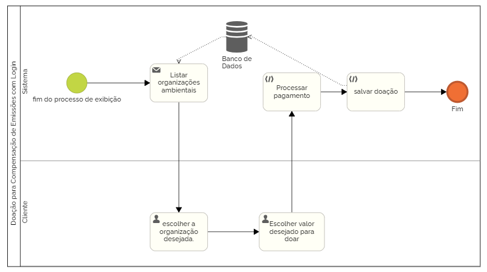

## 3.3.7 Processo 7: Doação para Compensação de Emissões com Login  
Descrição do Processo:
Usuários logados podem realizar ações diretamente pela plataforma, que registram a doação em nome do usuário e fornecem relatórios de impacto.
Modelagem do Processo (BPMN): 
Início : Ao fim do processo de exibição  
Passo 1 : O sistema gera uma lista de organizações ambientais parceiras. 
Passo 2 : O usuário seleciona a organização e o valor da doação. 
Passo 3: O usuário escolhe o valor do pagamento 
Passo 4 : O sistema processa o pagamento e realiza a doação em nome do usuário. 
Passo 5 : A doação é registrada no histórico do usuário. 
Fim : Doação confirmada e relatório de impacto gerado. 

 

# Oportunidades de Melhoria: 
Relatório de impacto acumulado , permitindo que o usuário acompanhe todas as suas doações e compensações.
Automatização de doações recorrentes , oferecendo um plano de assinatura para compensação mensal das emissões.

## Atividade 1: Doar para as instituições 
O usuario ira escolher a instuição e o valor que quer doar para nosso site fazer a doação em seu nome
## Estrutura de Dados Adicional

| Campo       | Tipo de Dado   | Restrições                          | Valor Default |
|-------------|----------------|-------------------------------------|---------------|
| Sugestão    | Texto/Lista    | Link de algum dos colaboradores     | Null          |
| Instituição | Texto/Lista    | Nome da instituição cadastrada no site | Null      |
| Valor       | Double/Float   | Tem que ser em reais                | Null          |

## Comandos Adicionais

| Comandos  | Destinos                                     | Tipo     |
|-----------|---------------------------------------------|----------|
| Inserir valor| Usuário coloca o valor de quanto quer doar | default |
| Doar | usuário clica para doar o valor colocado | default |

